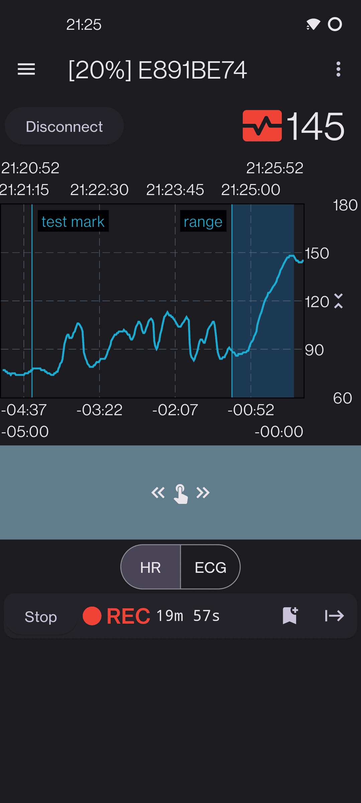
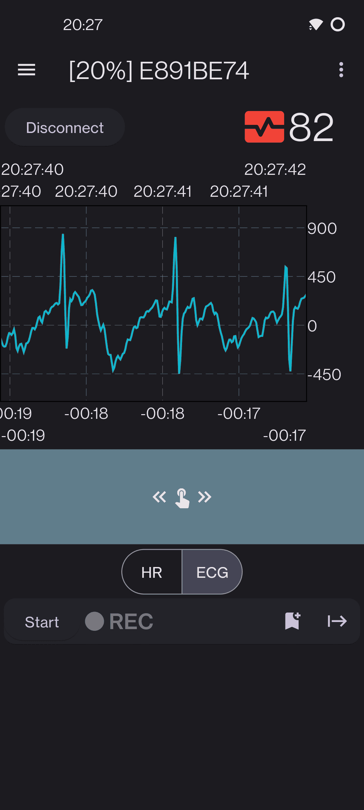
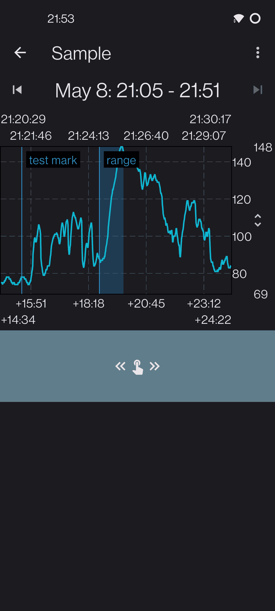
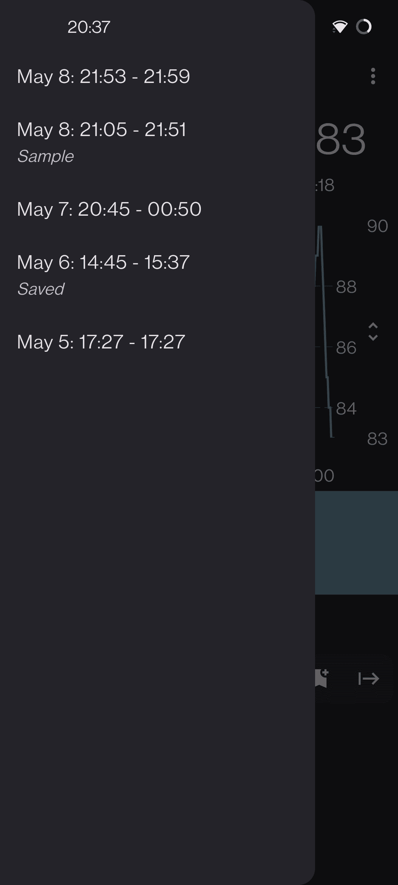

# PolarMon

PolarMon connects to your
[Polar H10](https://www.polar.com/en/sensors/h10-heart-rate-sensor) device
and displays some data from its sensors with the ability to save the fetched data.

 

 

## Features

* Show heart rate (HR) in real time with the resolution of 1 sample per second.
* Show electrocardiogram (ECG) in real time with the resolution of 130 samples per second.
* Record HR graph in background (the app may be closed meanwhile).
* Manage and analyze the saved recordings.
* Place markers on the graph during recording.
* Export/import the recordings (to/from the internal JSON format).

## Limitations

* Only connects to the first device it finds.
* Can only place markers at a current time.
* Cannot edit or remove markers once they have been placed.

The above limitations may or may not be resolved in the future.

## License

[MPL v2.0](LICENSE)

**NOTE:** PolarMon uses [Polar's SDK](https://github.com/polarofficial/polar-ble-sdk)
which is distributed under [Polar SDK License](https://github.com/polarofficial/polar-ble-sdk/blob/master/Polar_SDK_License.txt).
